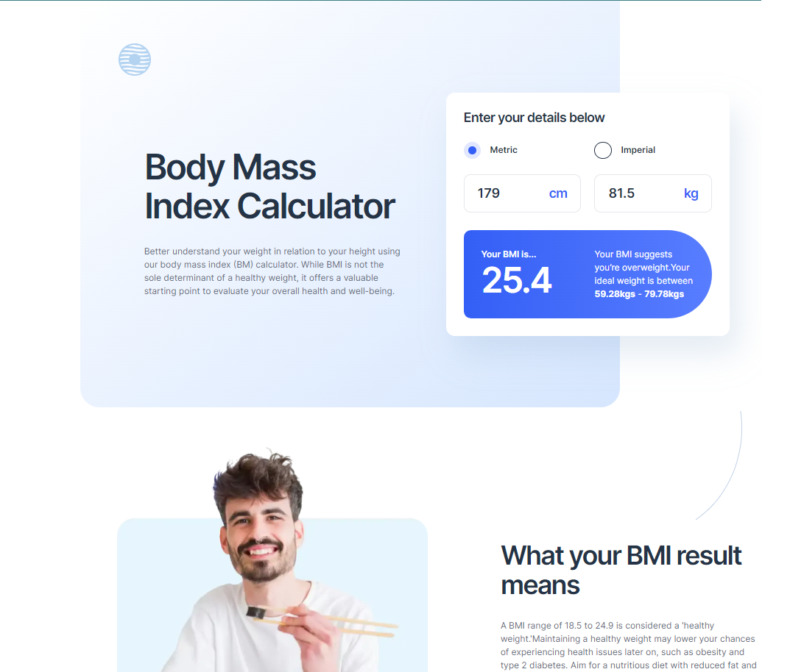

# Frontend Mentor - Body Mass Index Calculator solution

This is a solution to the [Body Mass Index Calculator challenge on Frontend Mentor](https://www.frontendmentor.io/challenges/body-mass-index-calculator-brrBkfSz1T). Frontend Mentor challenges help you improve your coding skills by building realistic projects.

## Table of contents

- [Overview](#overview)
  - [The challenge](#the-challenge)
  - [Screenshot](#screenshot)
  - [Links](#links)
- [My process](#my-process)
  - [Built with](#built-with)
  - [What I learned](#what-i-learned)
  - [Continued development](#continued-development)
  - [Useful resources](#useful-resources)
- [Author](#author)
- [Acknowledgments](#acknowledgments)

## Overview

### The challenge

Users should be able to:

- Select whether they want to use metric or imperial units
- Enter their height and weight
- See their BMI result, with their weight classification and healthy weight range
- View the optimal layout for the interface depending on their device's screen size
- See hover and focus states for all interactive elements on the page

### Screenshot

### Links

- Live Site URL: [bmi-calculator](https://bmi-calculator-psi-ten.vercel.app/)

## My process

### Built with

- Semantic HTML5 markup
- Flexbox
- Mobile-first workflow
- [Typescropt](https://www.typescriptlang.org/) - Typescript
- [Next.js](https://nextjs.org/) - React framework
- [Tailwind CSS](https://tailwindcss.com/) - For styles

### What I learned

I learned a lot about imperial units and conversion between metric and imperial.
It was great practice for writing functions and puting all together.

### Possible improvements

Add React Context,Redux or other state managment.

### Useful resources

- [Rapidtables website](https://www.rapidtables.com/) - This helped me with formulas for coverting metric to imeprial and vice versa.
- [Example resource 2](https://www.example.com) - This is an amazing article which helped me finally understand XYZ. I'd recommend it to anyone still learning this concept.

## Author

- Linkedin - [Tomislav Sertic](https://www.linkedin.com/in/tomislav-serti%C4%87-85a0941a3/)
- Frontend Mentor - [@tsertic](https://www.frontendmentor.io/profile/tsertic)
- Instagram - [@tsertic5](https://www.instagram.com/tsertic5/)
